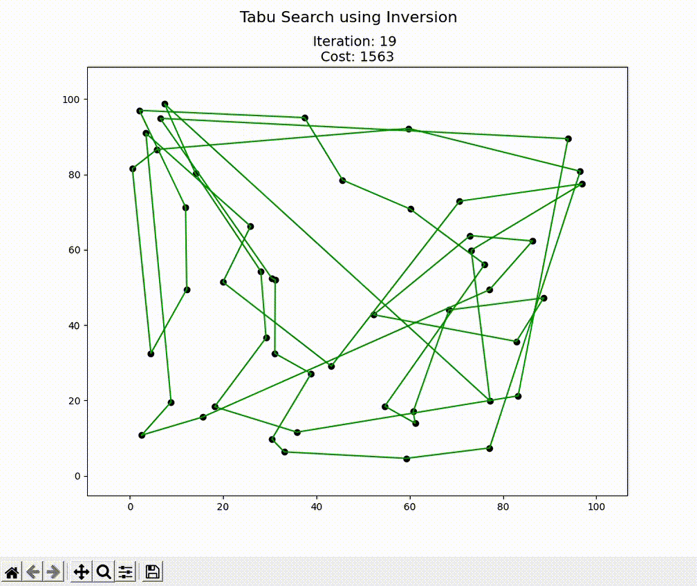

# Travelling Salesman Problem Example

The Travelling Salesman Problem (TSP) is an **NP-hard** (non-deterministic polynomial) problem in combinatorial optimisation.

Its growing complexity in real-world applications makes it unfeasible to compute an exact solution in a reasonable amount of time (even for super computers).

For this reason, three approximate algorithms are presented in this repository to offer approximate and yet robust solutions to this problem in a reasonable amount of computational time nad resources.

## Table of contents

- [Problem description](#Problem-description)
- [Instructions](#Instructions)
- [Algorithms](#Algorithms)
- [Neighbourhood operators](#Neighbourhood-operators)


## Problem description

Given a number of cities *n* and the distance matrix between each pair of cities *d*, the goal is to find the shortest route that visits each city just once and returns to the starting city.

In this example, we attempt to solve this problem by employing different pathfinding algorithms that rely on heuristic search in order to find an optimum path.

In order to achieve this, we need to take care of the following steps:
1. **Algorithm selection**: To be chosen from here [Algorithms](#Algorithms).
2. **Neighbourhood operator**: To be chosen from here [Neighbourhood operators](#Neighbourhood-operators).
3. **Initial Solution**: this can be either random (by default) or greedy approach.
4. **Solution evaluation**: for this problem, this is simply adding the cost of travelling through the cities.
5. **Stopping criteria**: No improvement after some iterations or conditions. Note that each algorithm has its own criteria for stopping.

## Instructions:
```bash
pip install requirements.txt

cd src/

python main.py
```
You can use any of the available [algorithms](#Algorithms) and modify their parameters to explore different behaviours. You can activate an animation to see how the algorithm progresses during the heuristic search process by setting: 

```py
run(animation=True)
```
|                   TSP search space                    |            TSP solution animation             |
|:-----------------------------------------------------:|:---------------------------------------------:|
|       |  |

**Note**: a version of **Python 3.8** or greater is needed in order to run this program. 

## Algorithms
Algorithms for this problem:
* [Simulated Annealing](./docs/SA.md#Simulated-Annealing) (SA)
* [Tabu Search](./docs/TS.md#Tabu-Search) (TS)
* [Genetic Algorithm](./docs/GA.md#Genetic-Algorithm) (GA)

## Neighbourhood operators
Neighbourhood operators available to choose from:
* Random exchange
  ```py
  key='ran_swap'
  ```
* Random exchange adjacent cities
  ```py
  key='ran_swap_adj'
  ```
* Inversion
  ```py
  key='inversion'
  ```
* 2-opt
  ```py
  key='two_opt'
  ```
