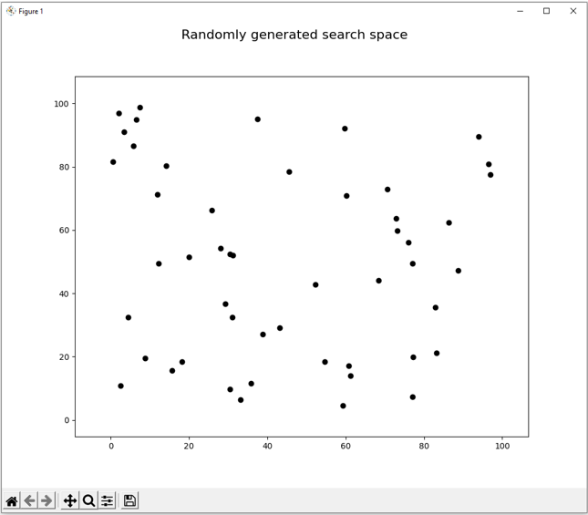

# Travelling Salesman Problem Example

The Travelling Salesman Problem (TSP) is an **NP-hard** (non-deterministic polynomial) problem in combinatorial optimisation.

Its growing complexity in real-world applications makes it unfeasible to compute an exact solution in a reasonable amount of time (even for super computers).

For this reason, three approximate algorithms are presented in this repository to offer approximate and yet robust solutions to this problem in a reasonable amount of computational time nad resources.

## Table of contents

- [Problem description](#Problem-description)
- [Instructions](#Instructions)
- [Output](#Output)
- [Algorithms](#Algorithms)
- [Neighbourhood operators](#Neighbourhood-operators)


## Problem description

Given a number of cities *n* and the distance matrix between each pair of cities *d*, the goal is to find the shortest route that visits each city just once and returns to the starting city.

In this example, we attempt to solve this problem by employing different pathfinding algorithms that rely on heuristic search in order to find an optimum path.

In order to achieve this, we need to take care of the following steps:
1. **Algorithm selection**: To be chosen from here [Algorithms](#Algorithms).
2. **Neighbourhood operator**: To be chosen from here [Neighbourhood operators](#Neighbourhood-operators).
3. **Initial Solution**: this can be either random (by default) or greedy approach.
4. **Solution evaluation**: for th TSP, this is simply adding the cost of travelling through the cities.
5. **Stopping criteria**: No improvement after some iterations or conditions. Note that each algorithm has its own criteria for stopping.

## Instructions

### Installation of dependencies

```bash
pip install requirements.txt
```

**Note**: a version of **Python 3.8** or greater is needed in order to run this program.

### Usage

This application is mainly intended to be run from the command line, as shown below:

```bash
cd src/

python main.py <algorithm> [<args>]
```

The algorithm argument is to be chosen from the available [algorithms](#Algorithms). You can also run:

```bash
python main.py -h
```

From each algorithm, you can modify their own parameters to explore different behaviours. To see their parameters, just run the help command. 

For example:

```bash
python main.py ts -h
```

The command above displays the optional arguments to input that are specific to the Tabu Search algorithm (ts).
If these optional arguments are not given, then the default arguments (displayed in the help menu) are taken.

**Note**: the optional command `--file` is empty by default. This means that a search space of cities will be randomly generated.
One can also specify a search space in `csv` format only, which needs to be stored under the [data](./data) folder. 

Also note that in [data](./data), there is already a file (TSP_50_nodes.csv) that can be used.

### Examples 
Running Simulated Annealing with the default arguments (search space randomly generated):

```bash
python main.py sa
```

Running Hill Climbing with some optional arguments (search space randomly generated):

```bash
python main.py hc --operator two_opt --climb_type ascent
```

Running Genetic Algorithm with some optional arguments (search space from a csv file):

```bash
python main.py ga --operator rand_swap_adj --elitism 0.5 crossover_rate 0.8 --file TSP_50_nodes.csv
```

## Output
You will see two plots. The first one is an animation of the selected algorithm (TS in this case) during the heuristic process:


|                   TSP search space                    |            TSP solution animation             |
|:-----------------------------------------------------:|:---------------------------------------------:|
|       |  |

The second one, is the history of the learning process of the algorithm over time. 


## Algorithms
Algorithms for this problem:
* [Simulated Annealing](./docs/SA.md#Simulated-Annealing) (SA)
* [Tabu Search](./docs/TS.md#Tabu-Search) (TS)
* [Genetic Algorithm](./docs/GA.md#Genetic-Algorithm) (GA)
* [Hill Climbing Algorithm](./docs/HC.md#Hill-Climbing-Algorithm) (HC)

## Neighbourhood operators
Neighbourhood operators available to choose from:
* Random exchange
  ```py
  key='rand_swap'
  ```
* Random exchange adjacent cities
  ```py
  key='rand_swap_adj'
  ```
* Inversion
  ```py
  key='inversion'
  ```
* 2-opt
  ```py
  key='two_opt'
  ```
